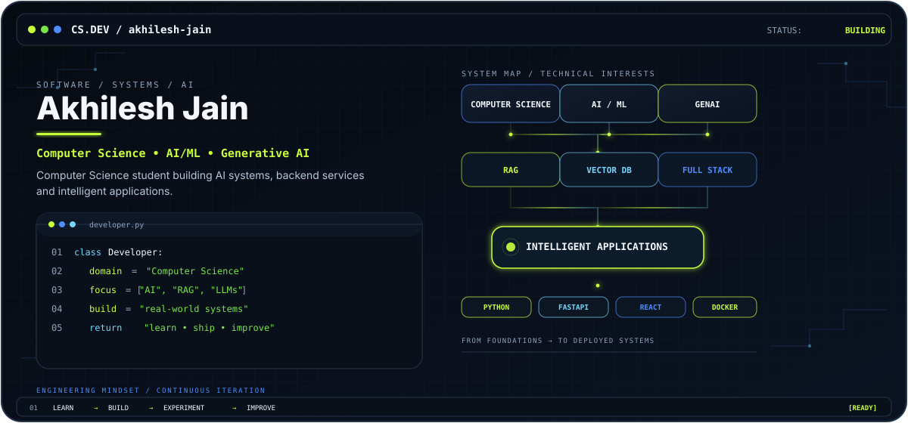

  

  

---

# 👋 Hi, I'm Akhilesh Jain

### 💻 Computer Science Student | AI/ML Enthusiast | Generative AI Explorer | Full-Stack Developer

I'm passionate about building **intelligent, practical, and scalable software applications** using Artificial Intelligence, Machine Learning, Generative AI, and modern web technologies.

My interests include **Large Language Models, Retrieval-Augmented Generation (RAG), Vector Databases, AI-powered applications, Machine Learning, Backend Development, and Full-Stack Systems**.

I enjoy turning ideas into working products by combining **AI + Software Engineering + Real-World Problem Solving**.

---

# 🧠 About Me

- 💻 Computer Science student
- 🤖 Exploring Artificial Intelligence and Machine Learning
- 🧠 Learning Generative AI and Large Language Models
- 🔎 Building Retrieval-Augmented Generation applications
- 🗄️ Exploring Vector Databases and Semantic Search
- 🌐 Developing Full-Stack Applications
- ⚡ Interested in AI-powered automation
- 🐳 Learning containerization and deployment
- 🚀 Turning ideas into practical software

---

# 🛠️ Tech Stack

## 👨‍💻 Programming Languages

<table>
<tr>

<td align="center">

 

<b>Python</b>

</td>

<td align="center">

 

<b>JavaScript</b>

</td>

<td align="center">

 

<b>TypeScript</b>

</td>

</tr>
</table>

---

## 🤖 AI / Machine Learning

<table>
<tr>

<td align="center">

 

<b>PyTorch</b>

</td>

<td align="center">

 

<b>Scikit-learn</b>

</td>

<td align="center">

 

<b>Generative AI</b>

</td>

<td align="center">

 

<b>LLMs</b>

</td>

<td align="center">

 

<b>RAG</b>

</td>

</tr>
</table>

**PyTorch • Scikit-learn • Generative AI • LLMs • RAG • LangChain**

---

## 🌐 Web & Backend

<table>
<tr>

<td align="center">

 

<b>React</b>

</td>

<td align="center">

 

<b>Vite</b>

</td>

<td align="center">

 

<b>FastAPI</b>

</td>

<td align="center">

 

<b>Flask</b>

</td>

<td align="center">

 

<b>Node.js</b>

</td>

</tr>
</table>

**React • Vite • FastAPI • Flask • Node.js • REST APIs**

---

## 🗄️ Databases & AI Storage

<table>
<tr>

<td align="center">

 

<b>MongoDB</b>

</td>

<td align="center">

 

<b>PostgreSQL</b>

</td>

<td align="center">

 

<b>ChromaDB</b>

</td>

</tr>
</table>

**MongoDB • PostgreSQL • ChromaDB • Vector Databases • Semantic Search**

---

## ⚙️ Tools & DevOps

<table>
<tr>

<td align="center">

 

<b>Git</b>

</td>

<td align="center">

 

<b>GitHub</b>

</td>

<td align="center">

 

<b>Docker</b>

</td>

<td align="center">

 

<b>Linux</b>

</td>

<td align="center">

 

<b>Hugging Face</b>

</td>

</tr>
</table>

**Git • GitHub • Docker • Linux • Hugging Face**

---

# 🚀 Featured Projects

## 🧠 RAG-Powered Document Q&A

An AI-powered document question-answering system based on **Retrieval-Augmented Generation**.

### ✨ Highlights

- 📄 Document ingestion
- ✂️ Text chunking
- 🧬 Embedding generation
- 🔎 Semantic retrieval
- 🗄️ Vector database
- 🤖 LLM-based response generation
- 💬 Natural-language document Q&A
- ⚡ FastAPI backend
- 🌐 Web interface
- 🐳 Docker support

### 🧰 Technologies

`Python` `FastAPI` `React` `RAG` `LLM` `ChromaDB` `Docker`

🔗 [View Repository](https://github.com/akhileshapjain2005-png/RAG-Powered-Document-Question-Answering-System)

---

## 🚦 Traffic Prediction & Route Optimization

An intelligent transportation application combining **machine learning, traffic prediction, route planning, mapping, and travel analysis**.

### ✨ Highlights

- 🚗 Traffic prediction
- 🗺️ Interactive maps
- 📍 Route planning
- ⏱️ Travel-time estimation
- ⛽ Fuel-efficiency analysis
- 🌦️ Weather-aware information
- 📊 Machine learning predictions
- 🌐 Interactive web interface

### 🤖 Machine Learning

- Random Forest
- Support Vector Regression
- Pandas
- NumPy
- Scikit-learn

### 🧰 Technologies

`React` `Vite` `Flask` `Python` `Scikit-learn` `Leaflet` `Pandas` `NumPy`

🔗 [View Repository](https://github.com/akhileshapjain2005-png/Traffic-Prediction-Route-Optimization)

---

## 🤖 HackForge AI

An AI-powered project designed around **AI-assisted development and intelligent project generation**.

The project explores how LLM-based systems can assist developers in transforming ideas and requirements into structured project concepts.

### 🧰 Technologies

`Python` `FastAPI` `AI` `LLMs` `Hugging Face` `Docker`

🔗 [View Repository](https://github.com/akhileshapjain2005-png/hackforge-AI)

---

## 🛒 Amazon Backend

A backend-focused project exploring API development and backend architecture for an Amazon-style application.

### 🧰 Technologies

`Python` `FastAPI` `Docker`

🔗 [View Repository](https://github.com/akhileshapjain2005-png/Amazon-backend_docker)

---

## 🌐 Personal Portfolio

A personal portfolio website showcasing development projects, technical interests, and work.

🔗 [View Repository](https://github.com/akhileshapjain2005-png/Akhileshjain-portfolio)

---

# 🧩 AI Development Journey

<pre>
                 ┌──────────────────────┐
                 │   ARTIFICIAL         │
                 │   INTELLIGENCE       │
                 └──────────┬───────────┘
                            │
                            ▼
                 ┌──────────────────────┐
                 │  MACHINE LEARNING   │
                 └──────────┬───────────┘
                            │
                            ▼
                 ┌──────────────────────┐
                 │   GENERATIVE AI     │
                 └──────────┬───────────┘
                            │
                            ▼
                 ┌──────────────────────┐
                 │ LARGE LANGUAGE       │
                 │ MODELS               │
                 └──────────┬───────────┘
                            │
                            ▼
                 ┌──────────────────────┐
                 │ RAG & SEMANTIC       │
                 │ SEARCH               │
                 └──────────┬───────────┘
                            │
                            ▼
                 ┌──────────────────────┐
                 │ AI-POWERED           │
                 │ APPLICATIONS         │
                 └──────────────────────┘
</pre>

---

# 📊 GitHub Analytics

---

# 💻 Most Used Languages

---

# 🔥 GitHub Streak

---

# 🏆 GitHub Trophies

---

# 📈 Contribution Graph

---

# 🎯 Current Focus

<table>

<tr>

<td align="center" width="250">

### 🤖 Generative AI

Building intelligent AI applications

</td>

<td align="center" width="250">

### 🧠 Large Language Models

Exploring modern LLM technologies

</td>

</tr>

<tr>

<td align="center" width="250">

### 🔎 RAG Systems

Retrieval and semantic search

</td>

<td align="center" width="250">

### 🗄️ Vector Databases

Embeddings and vector storage

</td>

</tr>

<tr>

<td align="center" width="250">

### ⚡ AI Automation

Intelligent workflows

</td>

<td align="center" width="250">

### 🌐 Full-Stack AI

AI-powered web applications

</td>

</tr>

<tr>

<td align="center" width="250">

### 🐳 Docker & Deployment

Containerization and deployment

</td>

<td align="center" width="250">

### 📊 Machine Learning

Data-driven solutions

</td>

</tr>

</table>

---

# 💡 What I Like Building

<table>

<tr>

<td align="center" width="260">

### 🤖 AI Applications

LLM-powered intelligent applications

</td>

<td align="center" width="260">

### 🔎 RAG Systems

Document retrieval & Q&A

</td>

</tr>

<tr>

<td align="center" width="260">

### 🌐 Web Applications

Modern full-stack applications

</td>

<td align="center" width="260">

### 📊 ML Systems

Data-driven intelligent solutions

</td>

</tr>

</table>

---

# 🧑‍💻 Developer Philosophy

### **Learn → Build → Experiment → Improve → Repeat**

> *The best way to understand technology is to build with it.*

---

# 🤝 Let's Connect

 

📧 **akhileshapjain2005@gmail.com**

💼 **[LinkedIn](https://www.linkedin.com/in/akhilesh-jain-97b3a72a6)**

---

 

### ⭐ Thanks for visiting my profile!

**Explore the repositories • Build something interesting • Keep learning 🚀**

